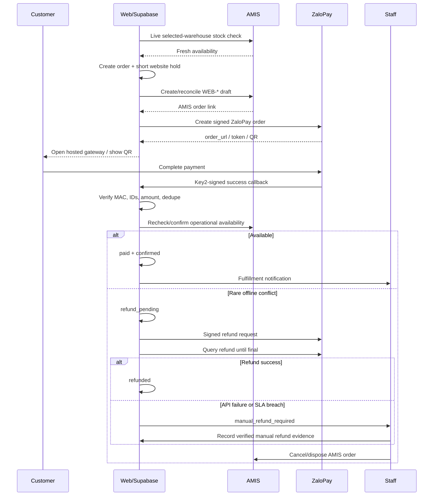

# Worktree 02 — Cart, ZaloPay Orders, AMIS Sale Orders, and Refund Operations

Branch: `codex/commerce-payment-amis`

Base: exact `<FOUNDATION_SHA>` from Plan 01

Status: planning only

## Outcome

Build a bounded commerce workflow on Supabase and AMIS. Do not add Medusa, Vendure, Saleor, Shopify, or a second inventory ledger for this release.

- AMIS is authoritative for physical stock, warehouses, offline sales, operational Sale Orders, and staff fulfillment.
- Supabase is authoritative for website carts, immutable online-order snapshots, orchestration state, soft holds between website checkouts, idempotency, and audit ledgers.
- ZaloPay is the only online payment gateway and is authoritative for successful payment and refund outcomes.
- Fillout/email may receive a notification projection; neither is the order database.
- AMIS mutation is limited to one feature-gated Sale Order draft capability. Customers, Contacts, Products, Stocks, and every other AMIS mutation remain unavailable.

This is the right trade-off for premium, scarce products and low paid-order volume. It avoids maintaining a full commerce engine while making the rare shared-stock conflict visible and recoverable through ZaloPay refund or an audited manual-refund fallback.

## Why a commerce platform is not justified now

Medusa/Vendure/Saleor would help if nanoHome needed promotions, complex tax/shipping, many channels, frequent fulfillment automation, returns/RMA automation, or a commerce-team back office. They do not solve the hard constraint here: the same scarce item may be sold offline through AMIS.

Adding one now would create:

- a second product/order/inventory model to reconcile;
- an additional database, deployment, upgrade, security, and observability surface;
- duplicate admin workflows for staff;
- the same offline race unless AMIS inventory can be atomically reserved;
- more migration risk than the current sales volume justifies.

Reconsider only when measured requirements exceed this bounded design—for example sustained order volume, promotion/tax/shipping complexity, multi-channel inventory reservation, RMA automation, or an organizational decision to make another platform the commerce authority.

## Authority matrix

| Domain | Authority | Supabase role |
| --- | --- | --- |
| Storefront content and visibility | Supabase catalog | canonical website record |
| Displayed price | Supabase projection from AMIS | reprice and snapshot at checkout |
| Physical stock | AMIS selected warehouse | live read plus immutable check record |
| Temporary website hold | Supabase | prevents website-vs-website oversell only |
| Website cart/order | Supabase | canonical online identity and customer status |
| Operational Sale Order | AMIS | linked by deterministic website order number |
| Online payment/refund outcome | ZaloPay | append-only callback/query/refund projection |
| Notification | email/Fillout | outbox delivery status only |

## Core invariants

1. Supabase creates the immutable online order number before any external side effect.
2. The AMIS `sale_order_no` is that exact order number, using a deterministic `WEB-*` format.
3. One checkout idempotency key and payload hash produce at most one Supabase order.
4. An external timeout is ambiguous; it is reconciled by lookup, never blindly retried.
5. Fixed-price payment cannot start without a fresh, complete, selected-warehouse AMIS stock result.
6. ZaloPay v2 is treated as an immediate-payment flow: create/reconcile the AMIS draft before creating the ZaloPay order.
7. An AMIS draft is not treated as a stock reservation unless a tenant test proves that behavior.
8. A Supabase soft hold protects concurrent website checkouts only. It cannot prevent an offline AMIS sale.
9. Exact raw SKU is the only product join key between Supabase and AMIS; do not normalize case, spaces, or punctuation.
10. Browser totals, availability, identity, AMIS fields, and payment state are never trusted.
11. Order, stock, AMIS, payment, refund, and integration histories are append-only.
12. No card data, ZaloPay Key1/Key2, AMIS token, complete external payload, or sensitive customer data appears in logs.

## Commercial eligibility

Use `CatalogEligibility` from Plan 00 at cart mutation and again at checkout.

| Price mode | Online behavior |
| --- | --- |
| `fixed` and fresh | eligible for paid checkout if live stock succeeds |
| `contact` | quote/request flow; no fabricated amount |
| `deposit` | disabled until deposit amount, cancellation, and AMIS accounting policy are approved |
| `unavailable` or stale | cannot start payment |
| made-to-order/configurable | consultation/quote unless a complete server-side pricing contract exists |

For a mixed cart containing any `contact` item, default the entire selected checkout to a quote request. Splitting fixed-price and contact-price lines requires explicit customer UX and separate order IDs; do not split silently.

## State model

Do not compress independent facts into one `status` field.

### Business order

```text
created -> processing -> awaiting_staff_confirmation -> confirmed -> fulfilled
created/processing/awaiting_staff_confirmation -> cancelled
any non-terminal state -> exception_review -> confirmed | cancelled | previous safe state
```

### Inventory

```text
unchecked -> checking -> available -> held_online
held_online -> staff_confirmation_required -> confirmed
checking -> unavailable | stale | failed
held_online -> expired | released
```

### AMIS export

```text
not_started -> pending -> creating -> exported_draft
creating -> ambiguous -> exported_draft | rejected | manual_required
pending/creating -> failed_retryable | failed_permanent
```

`ambiguous` means the request may have succeeded but the response was lost. Reconcile by deterministic order code before another POST.

### Payment

```text
not_required | requires_method
creating_zalopay_order -> awaiting_customer | create_failed | ambiguous
awaiting_customer -> paid | customer_left | expired | ambiguous
customer_left -> paid | expired | ambiguous
ambiguous -> awaiting_customer | paid | expired | manual_review
paid -> refund_pending -> refund_processing
refund_processing -> refunded | refund_failed | manual_refund_required
```

Only a Key2-verified ZaloPay callback or an authenticated server-to-server `/v2/query` response may establish `paid`. Only `/v2/query_refund` may establish an API refund's final state. The browser redirect is display/navigation state only.

## Stock check and website hold

Configure exactly one approved website fulfillment warehouse using both AMIS stock ID and name. Do not pool warehouses without an operational decision.

At paid checkout:

1. load all selected items from the server cart;
2. re-run catalog eligibility and price freshness;
3. fetch the complete relevant AMIS stock ledger, handling its pagination;
4. index by exact raw SKU;
5. fail closed for missing, duplicate, malformed, stale, or insufficient results;
6. record warehouse, observed quantity, requested quantity, checked time, source digest, and safe result code;
7. transactionally create short-lived Supabase holds.

```text
effective_online_available
  = latest live AMIS quantity
  - active non-expired Supabase website holds
```

Request coalescing and a seconds-level cache may reduce duplicate AMIS reads, but the accepted maximum age must be explicit and paid checkout must fail closed when it is exceeded.

Avoid double subtraction after an AMIS order begins affecting the ledger. The hold lifecycle needs a tested transition from `held_online` to AMIS-confirmed stock impact or release.

## AMIS Sale Order capability

The adapter is intentionally narrow:

```ts
interface AmisSaleOrderGateway {
  createDraft(input: CanonicalAmisDraft): Promise<CreateDraftResult>;
  findByCode(orderNumber: string): Promise<FindDraftResult>;
}
```

Rules:

- allow only `POST /api/v2/SaleOrders` and exact documented GET reconciliation paths;
- always use the AMIS draft revenue/status value proven in the tenant preflight;
- send the immutable Supabase order number as `sale_order_no`;
- send exact raw SKU as product code;
- use the configured warehouse and approved unit/tax/layout/employee/customer fields;
- compute every line and total from the server snapshot;
- validate record-level results even when HTTP status is successful;
- refresh an expired AMIS token at most once;
- on timeout, disconnect, 5xx, or duplicate code, enter reconciliation instead of generating a new order number;
- do not expose PUT, PATCH, DELETE, generic POST, or automatic AMIS customer creation in v1.

### Required tenant preflight

Before production code is enabled, use a non-production/test process to prove:

- required layout, unit, tax, warehouse, employee, customer, and line fields;
- whether the customer field expects an AMIS ID, code, or name;
- whether an approved generic `Website customer` is acceptable when no verified customer link exists;
- exact validation and partial-success response behavior;
- lookup by order code and duplicate-order behavior;
- whether draft, approval, or another state changes reported stock;
- whether staff can locate, confirm, cancel, and reconcile `WEB-*` orders efficiently.

Do not claim an AMIS draft reserves stock until this is verified in the actual tenant.

## ZaloPay-only capability

ZaloPay is selected as the only gateway for v1. Do not add another gateway, provider-selection UI, or a multi-gateway routing layer.

The ZaloPay v2 public contract reviewed on 2026-07-20 documents:

- `POST /v2/create` to create the ZaloPay order;
- a merchant callback authenticated with HMAC-SHA256 and Key2 after successful collection;
- `POST /v2/query` to reconcile the final order status;
- `POST /v2/refund` for full or partial refund;
- `POST /v2/query_refund` to establish final refund status.

The payment methods displayed inside the ZaloPay gateway—wallet, bank account, ATM/card, VietQR, or other methods enabled for nanoHome's merchant account—remain ZaloPay channels. They do not justify direct integrations with those networks.

### Required merchant and sandbox proof

Before production:

- confirm the enabled ZaloPay gateway model and payment methods;
- confirm per-transaction/daily limits for actual premium order values;
- confirm settlement, reconciliation files, fees, payout timing, and merchant support process;
- prove sandbox and production callback configuration;
- prove full refund, partial refund if desired, refund deadline, and status-query behavior for every enabled funding method;
- verify customer redirect/deep-link behavior on desktop and mobile;
- run a real operational refund drill before the paid canary.

The selected ZaloPay v2 flow is immediate payment followed by verified refund when a rare post-payment stock conflict occurs.

### Narrow adapter

```ts
interface ZaloPayGateway {
  createOrder(input: ZaloPayCreateInput): Promise<ZaloPayCreateResult>;
  queryOrder(appTransId: string): Promise<ZaloPayOrderResult>;
  verifyCallback(input: { data: string; mac: string }): VerifiedZaloPayCallback;
  refund(input: ZaloPayRefundInput): Promise<ZaloPayRefundResult>;
  queryRefund(merchantRefundId: string): Promise<ZaloPayRefundResult>;
}
```

The interface isolates signatures, validation, retries, and testing. It is not an abstraction intended to add another gateway.

### Identifier and signing rules

- derive one immutable `app_trans_id` per payment attempt; it must begin with the current Vietnam `yymmdd` required by ZaloPay and stay within the documented length;
- map `app_trans_id` to the immutable Supabase order and payment-attempt IDs; do not require it to equal the AMIS `WEB-*` number;
- allow at most one active ZaloPay attempt per online order;
- if creation times out, query that same `app_trans_id` before creating another attempt;
- create a new attempt on another day only after the old attempt is definitively unpaid/expired and cannot race to `paid`;
- generate `app_time` server-side and keep it within ZaloPay's accepted freshness window;
- choose `expire_duration_seconds` together with website-hold TTL and reconciliation grace; an expired UI session must not leave an active hold indefinitely;
- amount is integer VND and must equal the immutable server order snapshot;
- keep `item` within 2,048 characters and `embed_data` within 1,024 characters under the current contract; include only opaque internal references, not address, CRM notes, or unnecessary PII;
- use an opaque/default `app_user` where the merchant contract permits; do not send phone/email merely for convenience;
- sign create/query/refund requests with the correct Key1 contract;
- validate callbacks against Key2 before parsing them as trusted business input;
- store keys only in server secrets and never log MAC inputs containing sensitive data.

### Callback and reconciliation rules

- the browser `redirecturl` is never payment proof;
- `return_code=1` from `/v2/create` means the ZaloPay order was created; it does not mean the customer paid;
- verify callback HMAC over the exact `data` string before processing;
- verify `app_id`, `app_trans_id`, amount, currency assumptions, order mapping, and expected state;
- deduplicate by `app_trans_id` and `zp_trans_id` and use monotonic transitions;
- persist a safe callback receipt/digest before acknowledging the processed transition;
- repeated valid callbacks return the appropriate already-processed acknowledgement without fulfilling twice;
- if no callback arrives within the documented window, call `/v2/query`; ZaloPay's current documentation specifically instructs the merchant to query after 15 minutes without a callback;
- map `/v2/query` results explicitly: paid success, terminal failure, and unpaid/processing remain different states; verify the returned amount and `zp_trans_id` before transition;
- an ambiguous create/query response remains non-paid until a later verified query resolves it;
- release the website hold only after the payment attempt is definitively expired/unpaid or the order is resolved.

Leaving the browser is not cancellation: the customer may still complete payment before expiry. Before releasing the hold or disposing the AMIS draft, query the attempt and pass the configured expiry plus reconciliation grace.

### Refund rules

- use one deterministic unique `m_refund_id` per refund operation in ZaloPay's required date/app format;
- v1 automatically attempts a full refund for a confirmed stock conflict; partial refunds require explicit staff review;
- store `zp_trans_id`, requested amount, reason, actor, request digest, response status, and reconciliation timestamps;
- `PROCESSING` is not success; poll/reconcile with `/v2/query_refund` until `REFUND_SUCCESS`, terminal failure, or SLA breach;
- show the customer `refund_pending`/`refund_processing` until final status is verified;
- if the API refund is unavailable, rejected, outside its allowed window, or remains unresolved, create `manual_refund_required` with assigned owner, deadline, amount, destination/evidence policy, and final verification;
- never mark `refunded` from a staff checkbox alone.

## ZaloPay payment workflow



If the callback is missing, the reconciliation worker uses `/v2/query`; it does not trust the customer return page. This immediate-payment plus rare audited refund is the accepted premium/low-volume trade-off.

## Data model

Extend existing commerce tables through additive migrations; preserve historical order rows.

### `carts` and `cart_items`

- owner scope: guest token hash or user ID;
- state, version, expiry, merge metadata, timestamps;
- canonical variant ID, exact raw SKU, quantity, selected state;
- optimistic concurrency version;
- no trusted browser price.

### `orders`

- online order ID and immutable `WEB-*` number;
- `order_kind`: `quote_request | paid_order`;
- separate business, inventory, AMIS, payment, and refund states;
- checkout idempotency key and payload hash;
- currency and server-computed totals;
- contact, delivery, VAT, and locale snapshots with access restrictions;
- contact-price flag and checkout mode;
- stock time and selected warehouse snapshot;
- AMIS order ID/code/link timestamps;
- current ZaloPay payment-attempt reference and verified `zp_trans_id` where paid;
- confirmation, cancellation, refund, and retention timestamps.

### `order_items`

- product/variant IDs and exact raw SKU;
- immutable localized name, URL, and image identity;
- commercial mode and price/tax/discount/line snapshots;
- requested quantity and selected warehouse;
- AMIS stock observation and timestamp;
- recommendation request/placement attribution where consent allows.

### Append-only ledgers

- `inventory_checks`;
- `inventory_holds`;
- `order_status_history`;
- `checkout_attempts`;
- `amis_order_exports`;
- `zalopay_payment_attempts`;
- `zalopay_callback_receipts`;
- `zalopay_status_queries`;
- `refund_cases` and `refund_actions`;
- `commerce_outbox` and `order_integrations`.

ZaloPay attempt rows store `app_trans_id`, order mapping, amount, state, `order_url`/token lifecycle, `zp_trans_id`, expiry, and timestamps. Callback receipts store signature result, payload hash, safe parsed identifiers, processing state, and timestamps. Do not retain complete callback payloads or reusable checkout URLs longer than operationally required.

Required ZaloPay constraints:

- unique `app_trans_id` across all attempts;
- at most one active attempt per online order;
- unique successful `zp_trans_id`;
- immutable amount/currency/order mapping after create;
- unique callback receipt digest or stable callback identity sufficient to make repeats idempotent;
- `zalopay_status_queries` records query type, attempt/refund ID, request time, safe result code, response digest, and reconciliation decision;
- refund rows record unique `m_refund_id`, original `zp_trans_id`, amount, reason, actor, state, query result, and verified completion;
- checkout URLs/tokens expire and are never emitted into analytics, logs, or another user's response.

## API and worker surface

Customer/server-owned:

- `GET /api/cart`;
- `POST /api/cart/items`;
- `PATCH|DELETE /api/cart/items/:id`;
- `POST /api/cart/merge`;
- `POST /api/orders` as the idempotent orchestration entry;
- `GET /api/orders/:id` with owner authorization;
- `POST /api/payments/zalopay/create` through the order orchestrator or a tightly bound retry route;
- `GET /api/payments/zalopay/return` for customer display only;
- `POST /api/payments/zalopay/callback` with exact `data`-string Key2 verification.

Staff-only:

- confirm/reject operational stock;
- retry/reconcile AMIS ambiguity;
- initiate/query ZaloPay refund or record a verified manual refund;
- link an AMIS order manually;
- resolve an exception with actor, reason, evidence, and timestamp.

Worker-only:

- AMIS and ZaloPay create/status ambiguity reconciliation;
- ZaloPay attempt and website-hold expiry;
- outbox delivery and dead-letter recovery;
- Fillout/email projection;
- refund-status reconciliation.

## Failure policy

| Failure | Required behavior |
| --- | --- |
| AMIS stock unavailable/stale | block paid flow; quote may continue as pending |
| missing/duplicate/malformed SKU | block payment and create safe staff diagnostic |
| concurrent website checkout | atomic hold permits only the available quantity |
| offline sale after live check and before payment | stop the payment attempt where still possible; release hold and resolve the AMIS draft |
| ZaloPay create fails definitively | no payment; release hold and resolve the AMIS draft |
| ZaloPay create response is lost | query the same `app_trans_id`; never create a blind second attempt |
| AMIS validation fails | do not create the ZaloPay order |
| AMIS POST times out | `ambiguous`; GET by deterministic code |
| valid ZaloPay callback repeats or arrives out of order | deduplicate by `app_trans_id`/`zp_trans_id`; fulfill once |
| browser returns success but no verified callback | show processing; query ZaloPay, never mark paid from URL |
| no callback after the documented window | query `/v2/query`; keep state non-paid until resolved |
| customer leaves or attempt reaches expiry | query first; when definitively unpaid, release hold and queue the AMIS draft for staff disposition |
| paid then unavailable | `refund_pending`; call ZaloPay refund and reconcile |
| ZaloPay refund returns processing | remain `refund_processing`; query `/v2/query_refund` |
| refund fails, expires, or remains unresolved | `manual_refund_required`, assign and alert with SLA |
| Fillout/email fails | order/payment remains valid; replay outbox |
| no AMIS customer link | approved generic customer or manual export; no fuzzy match |

## Staff operations

The low-volume model depends on a good exception queue. Each case must show:

- Supabase, AMIS, `app_trans_id`, and `zp_trans_id` references;
- customer-safe contact and delivery summary;
- ordered SKUs, amount, current stock check, and failure reason;
- next allowed actions based on state;
- refund amount, `m_refund_id`, deadline, ZaloPay/manual evidence, and verification status;
- AMIS disposition and final actor/timestamp.

Because v1 does not automate AMIS update/delete, abandoned unpaid `WEB-*` drafts require a bounded staff cleanup queue. Low order volume makes this acceptable, but unresolved drafts must be counted and reviewed rather than silently accumulating.

Manual refund is acceptable only if it is a first-class auditable workflow. A spreadsheet, chat message, or status typed without provider/bank evidence is not completion.

## Implementation phases

### Phase 0 — capability proof

- run AMIS tenant preflight;
- configure and sandbox-test the nanoHome ZaloPay merchant application;
- verify create, Key2 callback, query, full refund, query-refund, enabled channels, limits, and settlement;
- freeze stock freshness, hold TTL, staff-confirmation SLA, and refund SLA;
- approve fixed/contact/mixed-cart rules;
- document that v1 is ZaloPay immediate payment with an audited refund fallback.

### Phase 1 — canonical server cart and order ledger

- converge current cart UI on server cart without changing its visual design;
- implement guest token, merge, selected-line checkout, immutable snapshots, idempotency, history, outbox, and RLS;
- keep current Fillout path behind a kill switch;
- no external mutation yet.

### Phase 2 — live AMIS stock and website holds

- implement exact-SKU, selected-warehouse complete ledger read;
- add atomic holds, expiry, and shadow comparison against existing stock projection;
- expose safe stock-unavailable UX.

### Phase 3 — controlled AMIS draft export

- add narrow POST adapter and GET-by-code reconciliation;
- test staging orders and staff handling;
- canary real `WEB-*` drafts with payment disabled.

### Phase 4 — ZaloPay

- add the ZaloPay-only adapter, hosted gateway UX, callback inbox, attempt ledger, `/v2/query`, refund, and `/v2/query_refund` reconciliation;
- test missing/duplicate callback, ambiguous create, expired attempt, full refund, processing refund, and manual fallback;
- enable immediate payment only after refund and reconciliation drills pass.

### Phase 5 — paid canary and cutover

- enable a small eligible-SKU/customer slice;
- require daily reconciliation during canary;
- expand one dimension at a time;
- retain independent AMIS export, ZaloPay create, ZaloPay API refund, and manual-refund-operation kill switches.

## File ownership

This worktree owns new commerce services/routes/UI, commerce migrations/tests, the dedicated AMIS Sale Order adapter, ZaloPay-only gateway adapter, order history, exception operations, and Fillout projection.

It must not directly edit:

- `src/lib/remote-read-only.ts` mechanism;
- `src/types/database.types.ts`;
- shared environment validation or `.env.example`;
- global providers, shared translations, `vercel.json`, `package.json`, or `pnpm-lock.yaml`.

The handoff to Plan 08 requests exact AMIS capability additions, ZaloPay App ID/Key1/Key2 and callback configuration, any approved dependency, schedules, translation keys, generated types, and composition wiring.

## Test matrix and hard gates

Test guest/auth isolation and merge; exact raw SKU behavior; fixed/contact/mixed carts; selected-line checkout; price tampering; AMIS pagination and warehouse scope; missing/duplicate SKUs; simultaneous holds; expiry; offline race; checkout retries; AMIS partial success; AMIS timeout/reconciliation; ZaloPay `app_trans_id` format/date/uniqueness; create MAC; Key2 callback verification; amount/ID mismatch; duplicate callbacks; missing callback plus query; lost create/query response; full refund; refund processing/query/failure; manual refund; outbox replay; Fillout failure; RLS; redaction; and kill switches.

Hard release gates:

- zero ZaloPay orders created without a recorded fresh stock check and linked AMIS draft;
- zero duplicate Supabase or AMIS orders under retries;
- zero blind retry after an ambiguous external call;
- zero client-controlled commercial values;
- every paid-but-cancelled order has verified ZaloPay refund state or a visible assigned manual-refund case;
- AMIS write access is limited to the exact Sale Order draft capability;
- no ZaloPay Key1/Key2 or AMIS secrets reach Supabase rows, client bundles, or logs;
- no alternative payment-gateway endpoint, dependency, environment variable, or UI option is present.

## Feature flags and rollback

- `COMMERCE_MODE=legacy_fillout|supabase_shadow|supabase_primary`;
- `AMIS_ORDER_EXPORT_MODE=off|staging|draft_primary`;
- `PAYMENT_MODE=off|zalopay_sandbox|zalopay_primary`;
- `AMIS_LIVE_STOCK_REQUIRED=true`;
- separate ZaloPay create, ZaloPay API refund, AMIS export, and manual-refund-operation flags.

Rollback stops new external side effects but never deletes valid orders or ledger rows. Existing ambiguous payment/AMIS/refund cases remain visible and reconcilable.

## Definition of done

- one retry-safe website order links at most one AMIS draft and at most one active ZaloPay attempt;
- paid checkout fails closed on stale or ambiguous commercial facts;
- staff can resolve every rare shared-stock conflict and prove the refund outcome;
- customer order status never claims payment/refund completion before verification;
- legacy notification failure cannot invalidate an order;
- the worktree supplies a complete handoff manifest without editing integration-owned shared files.

## Official references

- [AMIS CRM Connect v2](https://crmconnect.misa.vn/docs-v2/index.html)
- [AMIS OpenAPI JSON](https://crmconnect.misa.vn/swagger/v2/swagger.json)
- [AMIS API integration notes](https://helpcrm.misa.vn/kb/api/)
- [ZaloPay v2 create, callback, query, refund, and query-refund API](https://developer.zalopay.vn/v2/general/overview.html)
