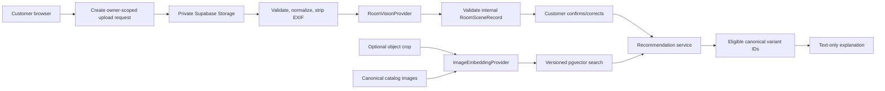

# Worktree 06 — Room Vision and Visual Product Similarity

Branch: `codex/vision-intelligence`

Base: exact `<FOUNDATION_SHA>` from Plan 01

Status: planning only

## Outcome

Deliver two related but separate capabilities:

1. privately analyze a customer room photo into a validated, uncertainty-aware room scene;
2. retrieve products with visually similar canonical images using a dedicated image-embedding model and `pgvector`.

DeepSeek remains a text-only orchestrator/explainer. It never sees raw images, signed image URLs, or vectors.

## Confirmed model boundary

The hosted DeepSeek chat API reviewed for this plan accepts text content; image input is not part of the managed chat contract. Open-source DeepSeek visual/OCR model repositories are self-hosted artifacts and are not the chosen v1 production path.

Use separate provider abstractions:

- `RoomVisionProvider` for scene understanding;
- `ImageEmbeddingProvider` for comparable image vectors;
- `RecommendationPort` for catalog/business reranking;
- DeepSeek for conversation, clarification, and explanation using sanitized structured results.

Do not assume one model is best for all four roles.

## Scope

### In scope

- explicit-consent private upload;
- image validation, normalization, metadata removal, bounded storage, and deletion;
- managed vision-provider adapter selected through benchmark/policy review;
- structured room type/style/palette/material/object/lighting/constraint/uncertainty output;
- customer confirmation/correction and manual measurements;
- canonical product-image embeddings with model/hash versioning;
- object crop/query embedding for “find similar”;
- `pgvector` retrieval followed by catalog/business reranking;
- narrow chatbot/recommendation ports;
- privacy, evaluation, observability, rollout, and fallback.

### Out of scope

- AR placement or generated redesigned-room images;
- reliable real-world dimensions from one uncalibrated photo;
- face recognition, identity, emotion, demographic, wealth, or sensitive-trait inference;
- OCR as a general room-understanding shortcut;
- self-hosted DeepSeek visual models in the initial production release;
- public room-photo URLs or permanent third-party image URLs;
- allowing AI/vision to publish products, prices, stock, image URLs, or arbitrary IDs.

## Two customer intents

### “What fits this room?”

Analyze the whole room into structured attributes. Use room type, style, palette, materials, objects, explicit measurements, constraints, catalog metadata, price preference, and availability.

Do not compare a whole-room embedding directly to isolated product images and claim physical/aesthetic fit. Room fit is a multi-signal recommendation problem.

### “Find something that looks like this chair/sofa/lamp”

Ask the customer to select/crop the object where useful. Embed that object image with the same compatible model/version as catalog images, retrieve nearest neighbors, constrain category, then rerank.

Visual similarity means visual resemblance, not guaranteed size, material, authenticity, function, or availability.

## Architecture



## Provider decision gate

Before implementation, benchmark candidate managed vision and image-embedding providers using only current official contracts and representative nanoHome data. Verify:

- supported image formats, bytes, pixel limits, orientation, and multi-image behavior;
- structured-output/schema support;
- room/furniture/material/style performance in Vietnamese customer use cases;
- embeddings designed for image-to-image retrieval and compatible query/catalog usage;
- provider/model version lifecycle and vector dimensions;
- data location, subprocessors, retention, deletion, and training terms;
- authentication, signed-URL versus byte upload, SSRF implications;
- rate limits, concurrency, retry semantics, latency, and cost;
- content/safety policy and error behavior.

Do not promise “zero retention” or “not used for training” unless the selected provider's current official terms and account configuration prove it. If policy cannot be approved, keep room-photo upload disabled.

## Upload workflow

Recommended server surface:

- `POST /api/vision/uploads` — verify identity, purpose consent, quota, MIME/size intent; create request and short-lived signed upload target;
- `POST /api/vision/uploads/:requestId/complete` — verify owner, object path, actual MIME/bytes/pixels/hash; enqueue idempotently;
- `GET /api/vision/requests/:requestId` — owner-scoped status and validated scene;
- `PATCH /api/vision/requests/:requestId/scene` — accept allowlisted customer corrections/measurements;
- `POST /api/vision/requests/:requestId/search` — room-fit retrieval;
- `POST /api/vision/requests/:requestId/crops` — create an owner-scoped object query;
- `POST /api/vision/crops/:cropId/search` — visually similar retrieval;
- `DELETE /api/vision/requests/:requestId` — delete originals, normalized copies, crops, scenes, and customer-specific derivatives.

Use direct-to-private-storage upload so application servers do not proxy large files. The server issues paths based on random request IDs—not customer filenames—and never exposes a service-role key.

### Processing states

```text
awaiting_upload -> uploaded -> normalizing -> analyzing -> ready
analyzing -> low_confidence | failed
any non-deleted owner state -> deleting -> deleted
awaiting_upload/uploaded -> expired -> deleting -> deleted
```

Retries are bounded and idempotent. A failed or low-confidence photo must not break text chat or normal catalog discovery.

## Internal room-scene contract

Plan 00's frozen `RoomScene` is the cross-feature public DTO. Internally retain provenance/confidence per observation before mapping to that DTO:

```ts
type ObservedValue<T> = {
  value: T;
  confidence: number;
  source: "vision" | "customer";
};

type RoomSceneRecord = {
  schemaVersion: "1";
  roomType?: ObservedValue<string>;
  styleTags: Array<ObservedValue<string>>;
  palette: Array<{ color: string; proportion?: number; confidence: number }>;
  materials: Array<ObservedValue<string>>;
  lighting: Array<ObservedValue<string>>;
  detectedObjects: Array<{
    type: string;
    count?: number;
    colors?: string[];
    materials?: string[];
    normalizedBox?: [number, number, number, number];
    confidence: number;
  }>;
  customerMeasurements: {
    widthCm?: number;
    depthCm?: number;
    heightCm?: number;
  };
  constraints: Array<{ code: string; description: string; confidence: number }>;
  uncertainties: string[];
  safetyFlags: Array<"person_present" | "sensitive_text_possible">;
};
```

Rules:

- validate provider output before persistence;
- preserve model observation and customer declaration separately;
- customer-supplied measurements override any visual estimate;
- never convert low-confidence/missing fields into confident prose;
- do not persist face boxes, biometric templates, inferred identity, or demographics;
- store the validated structure, not raw provider response, by default;
- version mapper/schema/provider/model independently.

## Customer confirmation

Before recommendations treat scene attributes as confirmed, show a lightweight correction UI:

- room type;
- main style/material/color tags;
- recognized furniture/object category;
- “not sure”/remove controls;
- optional width/depth/height entered by the customer with units;
- constraints such as doorway, child/pet, outdoor/indoor, or existing colors only when explicitly provided.

Never tell the customer a photo proves exact measurements. When size matters, ask for measured dimensions and delivery-path constraints.

## Product visual-embedding pipeline

Embed only canonical, customer-visible product images:

1. discover current canonical image and content hash;
2. enqueue an idempotent embedding job;
3. normalize the image consistently;
4. call `ImageEmbeddingProvider` with purpose `catalog`;
5. validate vector length/finite values/model metadata;
6. upsert by image hash and model version;
7. mark old vectors inactive only after replacement is verified;
8. retry bounded failures and expose a dead-letter/backlog queue.

Unique compatibility key:

```text
(product_image_id, image_hash, embedding_model_id, embedding_model_version)
```

Never compare vectors from different models, incompatible versions, preprocessing contracts, or dimensions. Support parallel versions during evaluation/migration.

For a small catalog, exact vector search may be sufficient. Add HNSW only after catalog-size/latency measurements justify indexing complexity.

## Visual retrieval and reranking

Candidate record:

```ts
type VisualCandidate = {
  variantId: string;
  productImageId: string;
  embeddingModelVersion: string;
  visualDistance: number;
  metadataScore: number;
  availabilityScore: number;
  finalScore: number;
  reasonCodes: string[];
};
```

After vector nearest-neighbor retrieval:

- enforce catalog visibility and commercial eligibility;
- constrain intended category/use case where known;
- combine material, palette, style, room, dimensions, and explicit price band;
- filter or label availability through current policy;
- apply curated relations/overrides;
- deduplicate same products/views/colors and enforce diversity;
- return canonical IDs and truthful `visually_similar`/room reason codes.

DeepSeek receives only sanitized scene fields and final candidate IDs/reasons. It cannot access the vector or signed image URL.

## Proposed storage and data model

### Private `room-photos` bucket

- private by default with owner-scoped policies;
- original, normalized, and crop prefixes separated;
- server-issued object paths;
- strict MIME, byte, pixel, and object-count limits;
- short signed upload/download TTL;
- lifecycle/deletion reconciliation.

### `vision_analysis_requests`

- request ID and owner scope;
- consent/policy version and purpose;
- object paths/hashes and state;
- idempotency key, provider/model/schema versions;
- bounded safe failure code;
- retention expiry and deletion timestamps.

### `room_scenes`

- request ID and validated internal structure;
- mapper/schema/provider/model versions;
- confidence/confirmation state;
- expiry/deletion timestamps.

### `vision_object_crops`

- owner request ID, normalized bounding box/object category;
- private crop path/hash and lifecycle;
- query embedding version/state.

### `product_visual_embeddings`

- product/variant/image IDs and image hash;
- view/crop type;
- provider/model/version/dimensions/vector;
- generation state, active flag, timestamps.

### Safe analytics

Events may record request/result IDs, model/algorithm versions, correction flags, latency buckets, and candidate IDs only under consent. Never put images, signed URLs, vectors, raw provider results, or full scene JSON into general analytics.

## Privacy, retention, and safety

Required controls:

- purpose notice and explicit consent before file selection/upload;
- EXIF/geolocation removal before provider processing;
- original deleted shortly after successful normalization/analysis under the approved retry policy;
- normalized image retained only for a bounded retry window unless separate storage/evaluation consent exists;
- derived customer room scene expires under a documented policy and supports immediate user deletion;
- separate opt-in for retaining an image in any evaluation corpus;
- scheduled deletion plus reconciliation for missed database/storage/provider artifacts;
- no face recognition/demographic inference;
- detect and handle people or sensitive text conservatively;
- no public bucket, permanent URL, or signed URL in logs/AI prompts;
- redact provider/application traces;
- document subprocessors and incident response.

Deletion completion means originals, normalized copies, crops, customer-specific scene/vector rows, caches, and queued jobs are gone or legally restricted. Catalog embeddings are not customer data and follow catalog lifecycle.

## Failure handling

Cover expired/incomplete upload; substituted object path; unsupported/corrupt/decompression-bomb image; excessive pixels; normalization error; provider timeout/429/5xx/authentication; invalid schema; no-room/low-confidence; model drift; vector dimension mismatch; stale catalog image; duplicate queue delivery; deletion failure; and downstream DeepSeek/recommender outage.

Each failure maps to a safe customer action: retry upload, choose another image, confirm manually, use text filters, provide measurements, or contact staff. Never expose raw provider errors.

## Evaluation

### Room-scene golden set

Use internal or separately consented representative photos with human-reviewed labels. Measure room-type accuracy; style/material/object precision/recall; palette quality; confidence calibration; abstention; schema validity; person/sensitive-content handling; customer correction rate; latency; and cost.

Do not score visually inferred dimensions as valid ground truth without a calibrated reference. The system should abstain and request measurements.

### Visual-similarity set

Create merchandiser-labelled image/product query pairs. Measure Recall@K, nDCG@K, category leakage, duplicates, hidden/stale exposure, diversity, latency/cost, and improvement over metadata-only ranking.

### Grounded-answer checks

- DeepSeek never receives an image/vector/URL;
- every returned product exists and is visible;
- price/stock/media are canonical at render time;
- low-confidence observations remain qualified;
- size/fit questions request customer measurements;
- customer A cannot access customer B's request, scene, crop, or result.

## Implementation phases

### Phase 0 — provider, privacy, and benchmark gate

- select providers using official documentation and representative evaluation;
- approve retention, processing, cost, and data terms;
- freeze internal `RoomSceneRecord` v1 and public mapping;
- set launch thresholds before customer uploads exist.

### Phase 1 — private upload foundation

- private bucket, owner RLS, signed upload, normalization, EXIF removal, state machine, limits, expiry, and deletion;
- no external provider available to customers yet.

### Phase 2 — room analysis

- provider adapter, async queue, validation, customer confirmation/correction, status UI, and internal golden-set evaluation;
- staff/internal accounts first.

### Phase 3 — catalog image embeddings

- embedding provider, catalog job/backfill, versioned vector storage, stale-image handling, and monitoring;
- no customer query until benchmark passes.

### Phase 4 — similarity and room retrieval

- object crop/query embedding, vector retrieval, metadata/business reranking, recommendation-port integration, and merchandiser review.

### Phase 5 — chatbot/customer UX

- sanitized Plan 04 tools and trusted cards/explanations;
- progress, consent, uncertainty, measurements, corrections, and deletion UX;
- text-only fallback remains complete.

### Phase 6 — controlled rollout

- internal pilot → opt-in room beta → small customer canary;
- compare metadata-only vs visual/scene-assisted quality;
- expand only after privacy, quality, latency, cost, and deletion gates pass.

## File ownership

This worktree owns new `src/lib/vision/**`, vision routes/components, private-storage policies, vision migrations/tests, provider adapters, product-image embedding jobs, and evaluation fixtures.

It does not edit chatbot/recommender internals, Plan 01 consent mechanism, shared product cards, global providers, shared env/translations, schedules, generated DB types, or lockfile. It publishes ports/contracts and a Plan 08 handoff.

## Test matrix and release gates

Unit/contract: scene validation/version mapping, confidence/unknown rules, provider malformed output/timeouts, MIME/bytes/pixels, vector compatibility, reranking, retention.

Integration/security: signed upload expiry, private RLS, cross-user isolation, object substitution/path traversal, SSRF, malicious/corrupt images, job idempotency, deletion reconciliation, re-embedding, parallel versions, secret/log leakage.

End-to-end: consent → upload → scene → confirmation → recommendations → visual chat; object crop → similar products; low confidence → clarification; provider outage → text fallback; owner deletion; mobile/accessibility.

Hard gates:

- 100% provider output schema validation before persistence;
- zero cross-user/private-image access;
- zero invalid/hidden product IDs;
- successful expiry/deletion reconciliation;
- visual retrieval beats the approved metadata-only baseline;
- approved quality, cost, latency, and confidence thresholds;
- no unsupported claim that a product physically fits from the photo alone.

## Feature flags and rollback

- `VISION_UPLOAD_ENABLED`;
- `ROOM_ANALYSIS_ENABLED`;
- `VISUAL_SIMILARITY_ENABLED`;
- provider/model/version selectors;
- `VISION_EVALUATION_STORAGE_ENABLED`;
- active catalog embedding version.

Rollback may disable new uploads, pause provider jobs, revert the embedding version, purge pending images according to policy, and fall back to metadata-only recommendations/text chat independently.

## Definition of done

- private room photos follow consent, RLS, retention, and verified deletion rules;
- scene observations preserve confidence and customer corrections;
- image vectors are model/hash/version compatible and evaluated;
- room-fit and object-similarity intents produce distinct, truthfully labelled results;
- DeepSeek receives only structured text and canonical candidate IDs;
- vision outages never break the catalog, deterministic recommendations, or text chatbot.

## Official references

- [DeepSeek Chat Completions](https://api-docs.deepseek.com/api/create-chat-completion/)
- [DeepSeek Anthropic compatibility](https://api-docs.deepseek.com/guides/anthropic_api/)
- [DeepSeek model list](https://api-docs.deepseek.com/api/list-models/)
- [DeepSeek-VL2 repository](https://github.com/deepseek-ai/DeepSeek-VL2)
- [Supabase Storage access control](https://supabase.com/docs/guides/storage/security/access-control)
- [Supabase private downloads and signed URLs](https://supabase.com/docs/guides/storage/serving/downloads)
- [Supabase semantic search](https://supabase.com/docs/guides/ai/semantic-search)
- [Supabase Queues](https://supabase.com/docs/guides/queues)
- [Supabase Cron](https://supabase.com/docs/guides/cron)
