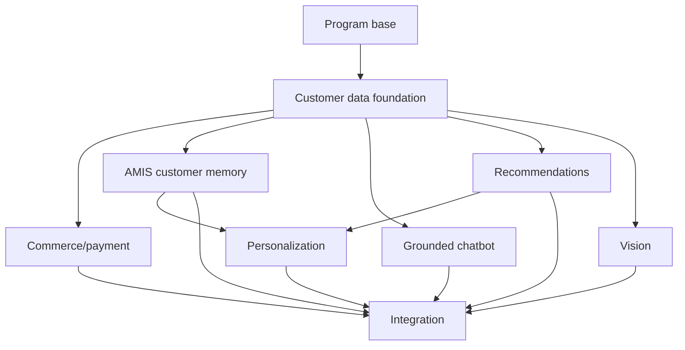

# Worktree 08 — Integration, End-to-End Verification, Rollout, and Operations

Branch: `codex/ai-commerce-integration-v2`

Base: reviewed integration branch containing Plan 01 foundation plus selected stable feature handoffs

Status: planning only; this lane is serial

## Outcome

Integrate the independently developed lanes without silently broadening permissions, overwriting shared files, duplicating migrations, or coupling feature availability.

At completion:

- one reviewed commit graph contains the selected capabilities;
- migrations work on clean-reset and existing-environment paths;
- shared environment, provider, translation, schedule, package, and generated-type changes are reconciled once;
- the complete checkout/refund, grounded chat, AMIS memory, recommendation, room-photo, personalization, withdrawal, and outage journeys pass;
- every capability has observability, an owner, a runbook, a feature flag, a canary plan, and a rollback path;
- no worktree remains the only source of implementation or operational knowledge.

## Preconditions

Do not start integration until:

- Plan 00 recorded `<PROGRAM_BASE_SHA>` and Plan 01 recorded `<FOUNDATION_SHA>`;
- intended feature branches are based on the correct SHA and have no unrelated changes;
- each lane passes its own tests and supplies a handoff manifest;
- migrations have unique reserved versions;
- public contracts are versioned and fixtures agree;
- the ZaloPay merchant application and vision provider have completed current official-contract/sandbox gates;
- AMIS tenant proof covers stock, Sale Order, Customer/Contact/SaleOrder read behavior;
- privacy/retention decisions are approved for CRM memory, conversations, events, and room photos;
- staging backup/recovery and migration-ledger evidence exist.

## Required handoff from every worktree

Each feature branch supplies one Markdown handoff containing:

- source branch and exact base/head SHAs;
- included and explicitly excluded scope;
- migrations in order plus rollback/forward-repair notes;
- owned files and any shared-file requests;
- new environment variables, secrets, packages, schedules, buckets, queues, policies, functions, and provider accounts;
- public contracts/ports and version changes;
- feature flags and safe defaults;
- commands/tests run and known failures;
- data backfill/shadow/canary requirements;
- metrics/alerts/dashboard queries;
- operational runbook links;
- security/privacy decisions and unresolved risks;
- safe rollback behavior after external side effects already exist.

An absent or vague handoff blocks merge. Integration should not reverse-engineer hidden feature assumptions from code.

## Worktree creation sequence

The commands below are a template; run only after Plan 00 makes the base clean and committed.

```bash
git worktree add ../temp-nanohome-customer-data -b codex/customer-data-foundation-v2 <PROGRAM_BASE_SHA>
```

After Worktree 01 is reviewed, merged, and `<FOUNDATION_SHA>` recorded:

```bash
git worktree add ../temp-nanohome-commerce -b codex/commerce-payment-amis <FOUNDATION_SHA>
git worktree add ../temp-nanohome-amis-memory -b codex/amis-customer-memory <FOUNDATION_SHA>
git worktree add ../temp-nanohome-chatbot -b codex/grounded-visual-chatbot <FOUNDATION_SHA>
git worktree add ../temp-nanohome-recommendations -b codex/product-recommendations-v2 <FOUNDATION_SHA>
git worktree add ../temp-nanohome-vision -b codex/vision-intelligence <FOUNDATION_SHA>
```

These five lanes may run in parallel. Do not start Plan 07 from one arbitrary feature branch. First create a reviewed temporary dependency base containing the stable **public contracts only** from AMIS memory and recommendations, or wait until those branches merge into the integration base; record that SHA, then:

```bash
git worktree add ../temp-nanohome-personalization -b codex/customer-personalization-v2 <PERSONALIZATION_BASE_SHA>
```

Finally create integration from the reviewed target base:

```bash
git worktree add ../temp-nanohome-ai-commerce-integration -b codex/ai-commerce-integration-v2 <INTEGRATION_BASE_SHA>
```

Directory names are examples; verify targets do not already exist. Do not create worktrees from a dirty directory, move uncommitted files between them, or allow two lanes to share `.env.local`, build output, dev ports, Supabase local state, queue names, or test databases.

## Dependency and merge strategy



Recommended integration order:

1. Plan 00 program base;
2. Plan 01 foundation;
3. Plan 02 commerce schema/services with external mutations disabled;
4. Plan 03 AMIS memory sync with consumer disabled;
5. Plan 05 deterministic recommendations;
6. Plan 04 chatbot public tools/corpus;
7. Plan 06 vision private foundation/internal processing;
8. Plan 07 personalization default/session/explicit phases;
9. reconcile cross-feature ports, shared UI, jobs, and environment;
10. activate capabilities through rollout waves, not at merge time.

The order minimizes shared dependency conflicts; it is not the production flag order. Use normal reviewed merges/cherry-picks that preserve provenance. Resolve conflicts by contract ownership, not “ours/theirs” bulk choices.

## Shared-file reconciliation

### Remote capability policy

Build a final allowlist matrix and test it:

| Feature | Methods and paths |
| --- | --- |
| existing AMIS catalog/stock sync | existing exact GET paths |
| commerce | exact SaleOrders POST plus exact lookup GET only |
| customer memory | Customers/Contacts/SaleOrders GET only |

Generic AMIS POST/PUT/PATCH/DELETE remains denied. Redirect/origin/near-path tests must run after all capabilities are composed.

### `src/app/providers.tsx` and layouts

Compose consent/event providers, cart, chat launcher, personalization context, and visual UI without duplicating cookies, fetches, portals, or hydration. Preserve server/client boundaries based on the installed Next.js 16.2.7 documentation.

### Product cards and mappers

Catalog, PDP, chat, recommendations, room results, and personalization all render the current canonical mapper/component. Reconcile locale, tracking request ID, price mode, stale stock, image fallback, and link behavior once.

### Environment and secrets

Add one validated server-only schema. Expected categories—not final names—include:

- DeepSeek key/base URL/model/timeouts;
- approved text/image embedding provider/model;
- room vision provider/model and retention policy;
- ZaloPay App ID, Key1, Key2, callback/redirect configuration, environment, and kill switches;
- AMIS selected warehouse and approved generic website-customer configuration;
- feature flags and algorithm/prompt/model versions;
- queue/cron secrets and alerting endpoints.

Mark variables public only when browser access is intentionally required. Service-role, AMIS, AI, vision, ZaloPay Key1/Key2, and callback secrets must never use a public prefix or appear in client bundles/logs.

### Packages and lockfile

Combine approved provider SDKs/dependencies once. Prefer a narrow ZaloPay adapter when an SDK is excessive, but implement HMAC input and verification exactly as the current official contract specifies and test against fixtures. Use `pnpm`; regenerate one lockfile and review transitive changes. Do not add another payment-gateway SDK.

### Localized messages

Merge Vietnamese, English, and Korean keys for consent, cart/order/payment/refund, chatbot, uncertainty, room upload/deletion, recommendation reasons, preferences, and failures. Missing locale keys fail tests; do not use model-generated runtime UI copy.

### Generated database types

Regenerate once after the complete integration migration sequence. Feature branches should use local interfaces/fixtures until then. Review changes for accidental schema exposure.

### Schedules, queues, and buckets

Inventory and compose:

- AMIS stock and customer-memory sync;
- source/chunk and embedding jobs;
- product-image embedding backfill;
- event aggregation and affinity calculation;
- outbox/ZaloPay query/AMIS/refund reconciliation;
- website-hold/ZaloPay-attempt/upload/conversation expiry;
- storage/database deletion reconciliation.

Every recurring job has a lock, idempotency, bounded batch, retry/dead-letter behavior, timeout, metric, owner, and manual replay procedure. Stagger schedules and cap concurrency to avoid exhausting AMIS/provider/database limits.

## Migration integration

### Static checks

- unique monotonically ordered versions;
- no modification of an applied migration;
- no conflicting table/function/policy/type names;
- explicit grants and RLS for each new object;
- functions set safe search path and least privilege;
- vector extensions/indexes are version-compatible;
- retention jobs cannot broaden delete scope;
- all destructive backfills are separately reviewed and recoverable.

### Clean-reset path

1. create isolated empty database;
2. run Plan 00 approved bootstrap;
3. apply complete migration sequence;
4. seed deterministic catalog/customer/order/vision fixtures;
5. regenerate types;
6. run schema/RLS/function/contract/e2e tests;
7. repeat from scratch to detect hidden state.

### Existing-environment path

1. take approved backup/recovery point;
2. compare remote ledger/fingerprint to Plan 00 evidence;
3. dry-run additive forward migrations on a restored clone where possible;
4. apply with external side-effect flags off;
5. validate grants/RLS/counts/query plans and application compatibility;
6. run backfills in bounded resumable jobs;
7. shadow and reconcile before enabling consumers.

Schema rollback is primarily forward repair. Feature rollback must not depend on dropping tables containing valid orders, payments, customer links, consent evidence, or deletion audit.

## End-to-end acceptance journeys

### 1. Anonymous discovery and quote

- no optional tracking before consent;
- public chatbot answers from approved source/catalog tools;
- contact-price product shows no fabricated amount;
- quote cart/order is idempotent;
- AMIS/customer memory/vision/payment outages do not block the handoff.

### 2. Fixed-price successful payment

- server cart and immutable snapshot;
- fresh selected-warehouse AMIS exact-SKU check;
- one atomic website hold;
- one deterministic `WEB-*` AMIS draft/link;
- one active signed ZaloPay order with valid `app_trans_id` and exact VND amount;
- Key2-verified/de-duplicated success callback, or `/v2/query` reconciliation when callback is missing;
- current customer order status and staff fulfillment handoff;
- retries create no duplicate order, AMIS draft, ZaloPay paid attempt, or fulfillment action.

### 3. Rare offline stock conflict and refund

- offline sale occurs after live check;
- customer order enters visible exception/refund-pending state;
- system submits one ZaloPay refund and reconciles `/v2/query_refund` to final status;
- failed/expired/unresolved API refund creates a manual-refund case with actor, amount, evidence, deadline, and AMIS disposition;
- customer is told `refunded` only after verification;
- all three systems reconcile and the incident metric increments.

### 4. AMIS ambiguity

- Sale Order POST response is lost after possible success;
- system marks ambiguous and queries deterministic code;
- no blind POST and no new order number;
- successful reconciliation links the existing order; unresolved case reaches staff.

### 5. Public grounded chat

- question about site/brand/product returns supported text and canonical visual blocks;
- model-provided invalid URL/price/ID is discarded;
- prompt injection cannot call private tools;
- DeepSeek outage returns search/source/handoff fallback.

### 6. Authenticated customer memory

- verified user/AMIS link and consent return bounded memory;
- prior product/approved brief can influence answer/recommendation with safe wording;
- another user, fuzzy phone/email, stale link, or public session receives no memory;
- raw notes/consultation cards never reach UI/model/events.

### 7. Room photo and recommendations

- explicit image-processing consent and private signed upload;
- EXIF removal, validated scene, uncertainty and correction/measurements;
- room-fit products from structured/reranked service;
- object crop returns visually similar products;
- DeepSeek receives no image/vector;
- deletion removes source and customer-specific derivatives.

### 8. Personalization and opt-out

- curated default → recent utility → explicit preferences → optional verified memory/room context;
- each product is eligible and reason is truthful;
- logout/account switch has no cache leakage;
- withdrawal stops scripts/events/memory/affinity/image use and triggers the correct deletion/restriction jobs;
- curated site remains complete.

### 9. External outage matrix

Independently simulate AMIS, ZaloPay create/callback/query/refund, DeepSeek, vision provider, embedding job, queue/cron, email/Fillout, and Supabase realtime failure. Verify each feature's fallback and ensure one outage does not cascade into unrelated customer journeys.

## Verification commands

Use actual repository scripts after checking `package.json` and installed Next.js guides. Expected gate:

```bash
pnpm test
pnpm exec tsc --noEmit
pnpm lint
pnpm build
git diff --check
```

Also run database/RLS contract suites, clean-reset twice, restored-clone forward migration, ZaloPay sandbox contract tests, browser network-consent tests, mobile/accessibility e2e, golden AI/recommendation/vision evaluations, callback/query/ambiguous-call tests, and secret/client-bundle scans.

## Feature flags and safe defaults

New flags default off in production. Group them independently:

- identity/events/third-party consent;
- Supabase commerce, AMIS order export, ZaloPay create/callback/query, ZaloPay refund, manual refund;
- AMIS customer sync and customer-memory consumers;
- public chat, conversation storage, customer/room/recommendation tools;
- deterministic/text/visual/behavior recommendation signals;
- vision upload, room analysis, visual search, image retention;
- recent/explicit/CRM/room/behavior personalization.

Validate impossible combinations at startup—for example ZaloPay create enabled while live AMIS stock, AMIS draft export, callback verification, or `/v2/query` reconciliation is disabled.

## Rollout waves

### Wave 0 — dark infrastructure

- schema, RLS, queues, buckets, source/feature projections;
- all customer UI and external mutations off;
- synthetic monitors and deletion drills.

### Wave 1 — internal/staff

- event/consent verification;
- AMIS customer-memory shadow sync;
- deterministic recommendation debug;
- public-corpus chatbot for internal users;
- vision golden-set processing;
- ZaloPay/AMIS sandbox, missing-callback query, API-refund, and manual-refund drills.

### Wave 2 — low-risk public discovery

- consented first-party analytics;
- deterministic PDP recommendations;
- public grounded chatbot;
- recently viewed and explicit preferences;
- no CRM memory or ZaloPay payment required.

### Wave 3 — opt-in rich context

- authenticated customer memory for reviewed linked accounts;
- opt-in room-photo beta;
- visual similarity and room recommendations;
- small cohorts with close privacy/quality monitoring.

### Wave 4 — commerce canary

- eligible fixed-price SKUs only;
- AMIS draft export first with payment off;
- then ZaloPay immediate payment for a tiny canary after create/callback/query/refund proof;
- daily order/AMIS/ZaloPay/refund reconciliation and on-call owner;
- expand by SKU/cohort, not a global switch.

### Wave 5 — behavioral optimization

- affinity/behavior recommendation signals only after reliable support;
- experiment holdouts and model/version canaries;
- no learning-to-rank until formal decision gate passes.

## Observability and runbooks

### Commerce

Monitor stock-check freshness/failure, active/expired holds, AMIS export ambiguity, ZaloPay create/query/payment/refund state, callback lag/duplicates/MAC failures, outbox age, conflicts, and reconciliation mismatch. Runbooks cover AMIS outage, ambiguous order, missing/invalid ZaloPay callback, ambiguous `app_trans_id`, stock conflict, API/manual refund, and Key1/Key2 rotation.

### Customer memory

Monitor sync lag, invalid/unknown fields, cursor/reconciliation mismatch, deleted/merged customers, link conflict, stale/null projection, access denial, and withdrawal backlog. Runbooks cover token failure, contract drift, wrong link, customer correction, and emergency consumer shutdown.

### Chat/recommendations

Monitor grounded coverage, invalid block attempts, unsupported claims, tool errors/latency, token/cost, source freshness, recommendation coverage/diversity/no-result, reason integrity, and golden-set regression. Runbooks cover model outage/change, prompt rollback, poisoned/stale source, and algorithm-version rollback.

### Vision

Monitor uploads, queue age, provider errors/cost/latency, invalid/low-confidence scenes, correction rate, embedding backlog/version mismatch, retrieval quality, private objects past expiry, and deletion failures. Runbooks cover provider outage, sensitive image incident, model migration, purge, and storage access review.

### Privacy/foundation

Monitor consent changes, pre-consent external requests, event rejection/rate limiting, identity/link conflicts, retention/deletion backlog, RLS denials, staff access, and secret exposure scans. Every alert has severity, owner, response SLA, and verification step.

## Rollback strategy

### Code/feature rollback

- switch individual feature/capability flags off;
- revert model/prompt/algorithm/embedding version;
- restore curated/static UI;
- keep read-only ledgers visible for reconciliation.

### External side-effect rollback

- stop new ZaloPay order creation, ZaloPay refund automation, and AMIS exports separately;
- do not erase existing online/AMIS/`app_trans_id`/`zp_trans_id` references;
- finish or explicitly assign every ambiguous/refund case;
- pause provider jobs and expire/delete room photos according to policy;
- stop customer-memory consumers before pausing sync if stale reads could be unsafe.

### Data rollback

Prefer additive forward repair. Do not drop order/payment/consent/link/deletion audit rows to make deployment look clean. Backfills are resumable and versioned; active projections can point back to a previous compatible version.

## Final security/privacy review

- exact remote method/path/origin matrix;
- public/authenticated/staff/worker/service RLS matrix;
- no public room-photo objects;
- no raw CRM notes/photos/payment data/general free text in analytics;
- no secret in client bundle, source map, log, error, or stored payload;
- verified ZaloPay callback MAC, ID/amount validation, deduplication, and replay protection;
- only ZaloPay payment endpoints, configuration, dependencies, and customer UI are present;
- prompt injection cannot broaden tools;
- customer-specific cache isolation;
- consent/withdrawal/retention/deletion proven end-to-end;
- providers and subprocessors match approved current terms;
- manual operations require actor, reason, evidence, and audit.

## Commerce-platform reconsideration checkpoint

Review Medusa/Vendure/Saleor or another platform only with measured evidence. Trigger a formal evaluation when several of these appear:

- sustained online order/operations volume overwhelms the bounded workflow;
- promotions, gift cards, complex tax/shipping, subscriptions, multi-currency, or marketplace requirements become core;
- automated returns/RMA and fulfillment orchestration are needed;
- multiple online channels require one commerce admin;
- AMIS provides an atomic inventory reservation/event contract or the business chooses a new inventory authority;
- commerce development is repeatedly rebuilding mature platform capabilities.

The evaluation must include migration/operating cost and specify which system becomes authoritative. Do not add a platform merely as another synchronized cart/order copy.

## Final acceptance report

Before production expansion, publish:

- deployed commit and migration ledger/fingerprint;
- enabled flags and cohort/SKU scope;
- provider/model/prompt/algorithm versions;
- test/evaluation results and accepted exceptions;
- RLS/security/privacy sign-off;
- AMIS/ZaloPay/refund reconciliation evidence;
- dashboards, alerts, owners, schedules, and runbooks;
- rollback drill results;
- unresolved risks, expiry/review dates, and next gate.

## Definition of done

- every selected feature branch is integrated from a documented handoff;
- shared capabilities remain deny-by-default and cross-feature contracts agree;
- clean-reset and existing-environment migration paths pass;
- all nine acceptance journeys and outage variants pass at the intended rollout scope;
- no paid ZaloPay transaction, private CRM context, room image, personalized HTML, or AI block bypasses its authority/consent/verification gate;
- each feature can be disabled independently while valid ledgers and recovery operations remain available;
- production expansion is controlled by measured gates, not merely a successful build.
