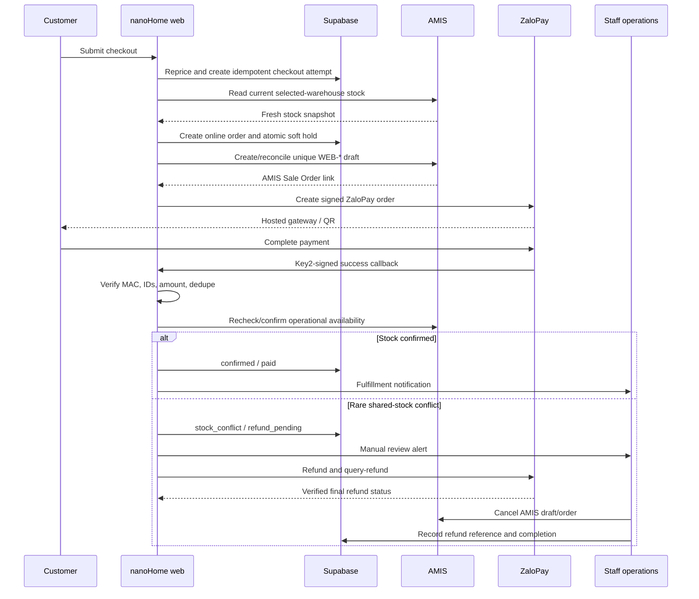
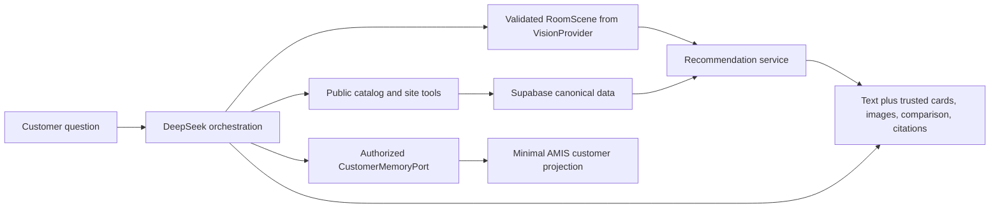
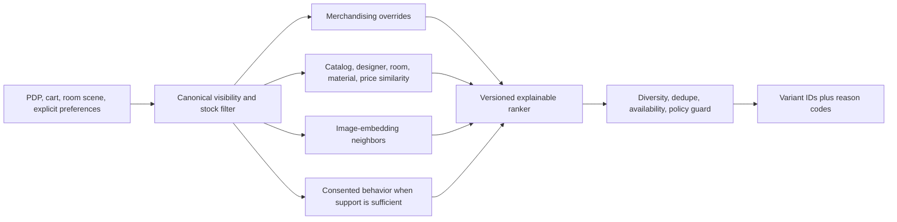
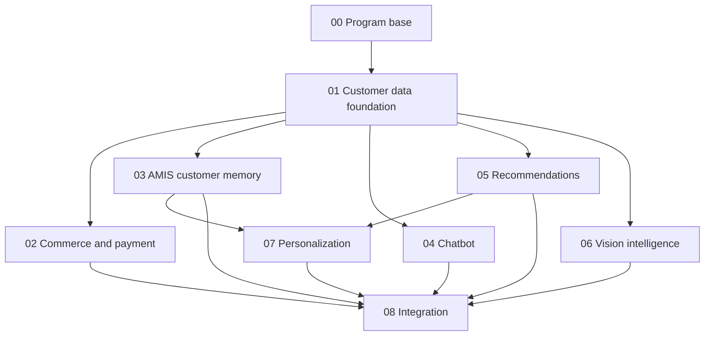

# nanoHome AI Commerce and Customer Experience Program v2

Vietnamese overview: [README.vi.md](./README.vi.md)

Status: planning only; no implementation worktree has been created

Architecture decision date: 2026-07-20

Repository snapshot inspected: `main` at `b28146d2417f95744c651c0a2c1927b17d1449aa`, two commits ahead of `origin/main`

## Executive decision

Build the first production version on the existing Next.js + Supabase + AMIS stack. Do not introduce Medusa, Vendure, Saleor, Shopify, a CDP, a recommender SaaS, a separate vector database, or an agent framework for the current premium, low-volume sales model.

ZaloPay is the only planned online payment gateway. No alternative gateway or multi-gateway routing is in scope.

The reasons are specific to nanoHome:

- AMIS already owns the shared physical stock used by online and offline sales.
- Products are premium and scarce, while paid online orders are expected to be infrequent.
- A rare stock conflict can be handled through an explicit manual cancellation/refund workflow.
- No headless commerce engine can reserve an item being sold directly in AMIS unless that engine becomes the inventory authority or AMIS provides an atomic reservation contract.
- Supabase already contains the online catalog and enough cart/order primitives to build the bounded workflow actually required.
- Recommendations will initially have sparse order behavior, so merchandising, catalog, room, style, designer, price, and visual signals are more useful than collaborative filtering.
- DeepSeek's hosted API is text-only. It remains the grounded conversation/orchestration layer; a separate vision provider handles customer room photos.

## Non-negotiable source-of-truth boundaries

| Domain | Authority | Projection or consumer |
| --- | --- | --- |
| Product, variant, brand, designer, category, editorial content, canonical media | Supabase | Website, chatbot, recommendations, personalization |
| Price and physical stock | AMIS | Read into the Supabase catalog projection; rechecked live at paid checkout |
| Online cart | Supabase | Browser cache is optimistic only |
| Online order and payment audit | Supabase | Projects to AMIS and staff tools |
| Operational Sale Order and offline fulfillment | AMIS | Linked to the Supabase online order |
| Successful online payment and refund outcome | ZaloPay | Supabase stores verified callback/query/refund outcomes and reconciliation IDs |
| Customer/Contact master and offline purchase history | AMIS | Minimal read-only customer-memory projection in Supabase |
| Website identity, consent, onsite preferences, first-party events | Supabase | Recommendation and personalization services |
| Raw AMIS calls, notes, emails, attachments, internal comments | AMIS | Never copied into general events or sent wholesale to an AI provider |
| Room photo | Private Supabase Storage for a bounded lifetime | Vision provider receives a short-lived server-authorized reference |
| AI narrative and tool selection | DeepSeek | May not invent commercial facts or state changes |
| Image/room interpretation | Vision provider abstraction | Produces a validated structured scene; does not directly choose final products |
| Recommendation decision | nanoHome ranker | Returns canonical variant IDs and truthful reason codes |

## Final customer flows

### Premium paid checkout



### Grounded visual assistant



### Product and room recommendations



## Plan files and implementation branches

| Execution order | Branch/worktree | Plan | Primary outcome |
| --- | --- | --- | --- |
| 0 | serial program-base commit | [00-program-base-and-contracts.md](./00-program-base-and-contracts.md) | Reconciled database baseline, canonical contracts, migration ranges, base SHA |
| 1 | `codex/customer-data-foundation-v2` | [01-customer-data-foundation.md](./01-customer-data-foundation.md) | Consent, identity, first-party events, exact capability factory |
| 2A | `codex/commerce-payment-amis` | [02-commerce-payment-amis.md](./02-commerce-payment-amis.md) | Canonical cart/order, AMIS Sale Order, ZaloPay and manual-refund workflow |
| 2B | `codex/amis-customer-memory` | [03-amis-customer-memory.md](./03-amis-customer-memory.md) | Read-only Customers/Contacts/SaleOrders projection and safe customer memory |
| 2C | `codex/grounded-visual-chatbot` | [04-grounded-visual-chatbot.md](./04-grounded-visual-chatbot.md) | DeepSeek assistant with public/customer scopes and typed visual answers |
| 2D | `codex/product-recommendations-v2` | [05-product-recommendations.md](./05-product-recommendations.md) | Deterministic explainable recommender and attribution |
| 2E | `codex/vision-intelligence` | [06-vision-intelligence.md](./06-vision-intelligence.md) | Room-photo analysis and product image similarity |
| 3 | `codex/customer-personalization-v2` | [07-customer-personalization.md](./07-customer-personalization.md) | Explicit preferences, recently viewed, customer memory, affinity and transparency |
| 4 | `codex/ai-commerce-integration-v2` | [08-integration-rollout.md](./08-integration-rollout.md) | Merge, shared files, end-to-end verification, canary, rollback and operations |

Worktrees 2A-2E may run in parallel only after Worktree 01 is merged into one recorded `<FOUNDATION_SHA>`. Personalization depends on the public recommendation and customer-memory contracts. Integration is serial and starts only after the intended feature branches have stable handoffs.

## Dependency graph



## Shared contracts that must be frozen before parallel work

The program base owns contract packages and fixtures, not feature implementations:

- `CatalogEligibility`: one storefront visibility, commercial-state, price-mode, image, and stock policy.
- `ServerCustomerContext` and `ClientCustomerContext`: HttpOnly identities remain server-only.
- `CommerceOrderSnapshot`: immutable line, price, tax, contact and commercial-state snapshot.
- `CustomerMemory`: bounded AMIS-derived fields approved for customer-facing use.
- `RecommendationRequest` and `RecommendationResponse`: placement-specific context, canonical IDs, reason codes and attribution request ID.
- `RoomScene`: validated room type, style, palette, materials, detected objects, constraints, uncertainty and confidence.
- `VisualSimilarityResponse`: model/version, query image hash and canonical neighbor IDs.
- `ChatAnswer`: plain text plus allowlisted typed blocks; no arbitrary HTML, image URL, price or stock value.

Feature worktrees use ports and fixtures so they compile without importing another worktree's internals:

```ts
interface InventoryProvider {}
interface OperationalOrderProvider {}
interface ZaloPayGateway {}
interface CustomerMemoryPort {}
interface RecommendationPort {}
interface VisionProvider {}
interface VisualSimilarityPort {}
```

## Worktree isolation rules

1. Every branch records the exact dependency-base SHA in its plan and handoff.
2. No worktree branches from a dirty working directory or from an independently selected `main`.
3. Each lane receives a non-overlapping Supabase migration range.
4. Each lane owns its namespace, tests and narrow remote capability adapter.
5. Only integration edits generated database types, shared translations, shared environment validation, global providers, package lockfile and schedules.
6. Cross-feature communication uses frozen ports/contracts and fixtures.
7. No feature branch broadens `src/lib/remote-read-only.ts` with a wildcard. Worktree 01 provides an exact-method/exact-path capability factory; each feature requests only its named routes.
8. Use `pnpm` commands because the repository has `pnpm-lock.yaml` and no Bun lockfile.
9. Before implementation, read the relevant installed Next.js 16.2.7 guide under `node_modules/next/dist/docs/`; do not assume older Next.js conventions.

## Current repository gate

At the v2 planning snapshot:

- `main` is two commits ahead of `origin/main`.
- `docs/` and `outputs/` are untracked.
- duplicate migration prefixes exist at `20260710000003_*` and `20260711000000_*`.
- the production Supabase migration ledger has not been verified from this planning thread.
- the existing OpenCode `swift-engine` worktree is based on another older commit.

Therefore do not create the feature worktrees yet. First complete Plan 00, decide what belongs in `docs/`, keep unrelated `outputs/` artifacts separate, commit one canonical program base, and record its SHA.

## Rollout principles

- Every new feature is independently feature-flagged.
- The existing curated site remains complete when AI, vision, personalization, AMIS, payment or background jobs are unavailable.
- Public chatbot launch precedes customer-memory access.
- Vision launches first for internal evaluation, then room-photo beta with explicit consent and deletion controls.
- Payment launches by eligible SKU/product policy and a small canary, not for every catalog item.
- Contact-price and made-to-order products remain quote/deposit flows until their exact commercial policy is approved.
- ZaloPay browser redirects never establish payment truth; only a Key2-verified callback or authenticated server-to-server `/v2/query` response does.
- A rare paid stock conflict creates an explicit operational incident and refund case; it is never silently hidden.
- Raw CRM notes and room photos are never mixed into general analytics or recommendation events.

## Program success measures

### Correctness and safety

- Repeated checkout retries with one idempotency key produce one online order, one AMIS order link and at most one active ZaloPay attempt.
- Every paid ZaloPay transaction is reconciled to an online order, AMIS order, `app_trans_id`, and `zp_trans_id`.
- Every refund case has an actor, reason, `m_refund_id` or manual evidence, AMIS disposition and completion timestamp.
- No public or unrelated authenticated session can access AMIS-derived customer context.
- No raw CRM note, full address, identity document, bank/debt field or private room image appears in general events or AI logs.
- Recommendations never bypass catalog visibility, current-item exclusion or availability policy.
- AI prices, stock, media and links are resolved from canonical records at render time.

### Product value

- Checkout completion, payment failure, stock-conflict and refund rates.
- Chat grounded-answer coverage, card clicks, qualified handoffs and unsupported-answer rate.
- Recommendation coverage, diversity, CTR, add-to-cart and order attribution versus curated baseline.
- Room-analysis confirmation/correction rate and visual-neighbor precision on merchandiser-labeled examples.
- Preference completion, reset/disable rate and personalized placement lift versus deterministic holdout.

## Explicitly deferred

- Full commerce-platform re-platforming.
- DeepSeek self-hosted vision models in production.
- Autonomous AI cart/order/payment changes.
- Raw AMIS note RAG.
- Cross-device identity graph or demographic inference.
- Learning-to-rank before sufficient attributed traffic and an experiment baseline.
- Exact room measurements inferred from one photo.

## Authoritative references

- AMIS: [CRM Connect v2](https://crmconnect.misa.vn/docs-v2/index.html), [OpenAPI JSON](https://crmconnect.misa.vn/swagger/v2/swagger.json), [API integration notes](https://helpcrm.misa.vn/kb/api/), [customer activity history](https://helpcrm.misa.vn/kb/quan-ly-chi-tiet-ban-ghi-khach-hang/)
- ZaloPay: [v2 create, callback, query, refund, and query-refund API](https://developer.zalopay.vn/v2/general/overview.html)
- DeepSeek: [Chat Completions schema](https://api-docs.deepseek.com/api/create-chat-completion/), [model list](https://api-docs.deepseek.com/api/list-models/), [tool calls](https://api-docs.deepseek.com/guides/tool_calls), [Anthropic compatibility](https://api-docs.deepseek.com/guides/anthropic_api/)
- Supabase: [RLS](https://supabase.com/docs/guides/database/postgres/row-level-security), [Storage access control](https://supabase.com/docs/guides/storage/security/access-control), [private downloads and signed URLs](https://supabase.com/docs/guides/storage/serving/downloads), [semantic search](https://supabase.com/docs/guides/ai/semantic-search), [hybrid search](https://supabase.com/docs/guides/ai/hybrid-search), [Queues](https://supabase.com/docs/guides/queues), [Cron](https://supabase.com/docs/guides/cron)
- Medusa decision reference: [Inventory concepts](https://docs.medusajs.com/resources/commerce-modules/inventory/concepts), [ERP integration recipe](https://docs.medusajs.com/resources/recipes/erp), [deployment](https://docs.medusajs.com/learn/deployment)
