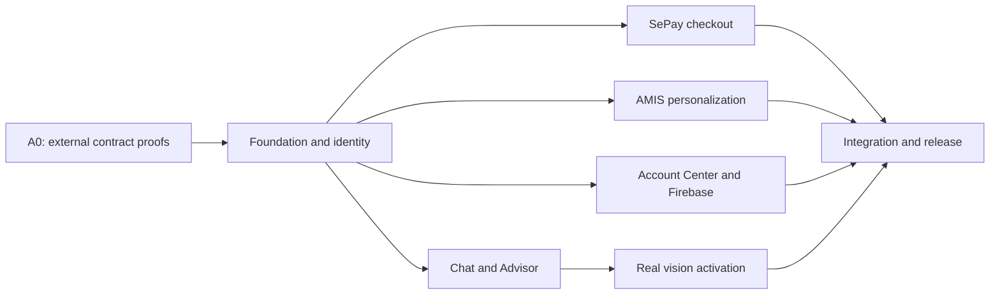

# nanoHome AI Commerce v3 — Master Execution Plan

Status: approved for local implementation; external services remain gated
Execution baseline: `origin/codex/ai-commerce-staging` plus the six newer
product-dimension fixes from `origin/main`
Date: 2026-07-25

This document turns Plans 01–04 into one implementation program. It is the
coordination contract for the Git worktrees, OMO sessions, merge order,
environment setup, and 15-minute heartbeat.

## 1. Program outcome

The release is complete when a customer can:

1. use a polite, lightly humorous, fact-grounded AI product advisor;
2. browse product and media cards in horizontal carousels;
3. upload a private room/product image and receive real structured analysis;
4. persist a conversation and hand it to a Customer Advisor;
5. check out through SePay bank transfer with server-verified payment state;
6. sign in by email link, email/password, Google, Kakao, or phone-only SMS;
7. use the responsive Account Center for profile, orders, wishlist, cart,
   offers, personalization, and security;
8. receive recommendations based on a safe AMIS projection, where an
   `approved` SaleOrder is a purchase and other active orders are
   quote/interest signals.

The global consent banner is removed. Privacy, access control, retention,
deletion, audit, and opt-out controls remain mandatory.

## 2. Source plans

- [Plan 01 — AI Chat, Vision, and Customer Advisor](./01-ai-chat-vision-customer-advisor.md)
- [Plan 02 — SePay Checkout](./02-sepay-checkout.md)
- [Plan 03 — AMIS Personalization and Recommendations](./03-amis-personalization-recommendations.md)
- [Plan 04 — Account Center and Firebase Authentication](./04-account-center-firebase-auth.md)
- [Environment matrix](./ENVIRONMENT-MATRIX.md)
- [OMO/WSL runbook](./OMO-RUNBOOK.md)

When documents disagree, this master plan controls sequencing and ownership;
the domain plan controls detailed behavior and acceptance tests.

## 3. Non-negotiable product and security decisions

- Product truth is rehydrated from the canonical catalog. The model never
  invents price, stock, URL, image, promotion, order, or customer facts.
- Product/media results use accessible horizontal, scroll-snapping carousels,
  not grids.
- Images are private, size/type limited, malware-scanned, EXIF-stripped,
  expiring, and deletable.
- Notifications contain a secure Advisor Inbox link and redacted summary, not
  the full transcript.
- Browser return URLs never mark an order paid. Only verified SePay IPN or
  server reconciliation may do so.
- Phase 1 SePay uses hosted `BANK_TRANSFER`. SePay does not supply a generic
  card-style authorize/capture inventory hold; stock is reserved by nanoHome
  before payment.
- Refund is an explicit audited operation. Until the merchant/refund contract
  is verified, the application records refund intent and evidence without
  claiming that a bank transfer has been automatically reversed.
- Supabase remains the business database and storage platform; only
  authentication moves to Firebase/Identity Platform.
- Business ownership uses internal UUID `customer_accounts.id`; Firebase UID
  is an external identity mapping and may be non-UUID.
- AMIS data is synced server-to-server into restricted snapshots and a safe
  projection. Raw CRM notes, debt, phone, address, and internal comments never
  enter the browser or model prompt.
- No secret is printed to a terminal pane, committed, copied into a prompt, or
  sent through chat. Public Firebase Web SDK fields are still configured
  explicitly and never guessed.

## 4. Dependency graph

Implementation does not wait idly for every A0 credential. Interfaces, schema,
fake adapters, deterministic fixtures, UI, and offline tests proceed with all
external side effects disabled. Live activation remains gated.

## 5. Delivery waves

### Wave 0 — establish a clean baseline

- Start from reviewed staging SHA.
- Integrate all six newer `origin/main` product-dimension fixes.
- Include this complete plan bundle.
- Run baseline install/build/typecheck/test commands that are available without
  production credentials.
- Push one immutable execution-base branch for all WSL worktrees.

Exit: every lane starts from the same clean commit and the existing dirty WSL
root worktree is untouched.

### Wave 1 — common foundation and identity

- Read the repository's bundled Next.js documentation before changing
  framework code.
- Add only forward Supabase migrations.
- Establish `customer_accounts`, external identity mapping, guest/auth order
  identity, provider-neutral payment ledger, conversation/handoff tables,
  attachment intent, personalization settings, AMIS restricted snapshots, and
  offer eligibility/reservation contracts.
- Implement conditional typed environment validation and safe feature-flag
  defaults.
- Prove RLS with a non-UUID Firebase UID.
- Establish Firebase Admin session-cookie authorization behind
  `AUTH_PROVIDER=supabase`.

Exit: shared data contracts and identity boundaries are mergeable without
enabling Firebase, SePay, vision, notification, or AMIS writes.

### Wave 2 — parallel product lanes

#### Chat and Advisor

- Replace chat result grids with shared product/media carousels.
- Add the Vietnamese polite-humorous tone contract and regression fixtures.
- Add approved knowledge ingestion/retrieval contracts.
- Persist conversations and restore the active conversation after reload.
- Implement handoff creation, Advisor Inbox assignment/status, outbox, and
  noop/test notification adapter.
- Add private attachment and structured vision-provider interfaces with a fake
  provider; real provider activation waits for benchmark and credentials.

#### SePay checkout

- Extract a provider-neutral payment port and server-owned order flow.
- Implement SePay hosted-bank-transfer request, signature, IPN validation,
  idempotency, state machine, status page, and reconciliation interfaces.
- Default `PAYMENT_MODE=off`; use fixtures until Sandbox is available.
- Remove ZaloPay from selectable checkout UI while preserving unrelated Zalo
  OA/customer-chat functionality.
- Add wrong-reference, wrong-amount, forged, duplicate, delayed, cancelled,
  timeout, reconciliation, and refund-intent tests.

#### AMIS personalization

- Implement page-0-safe read clients for Customers, Contacts, and SaleOrders.
- Store restricted raw snapshots server-side and derive a safe projection.
- Interpret the tenant-validated `approved` value as purchase; represent other
  active records as `quoted_or_interested`.
- Build deterministic recommendation candidates and explanation codes from
  canonical catalog facts.
- Run shadow mode using synthetic/redacted fixtures. No tenant write and no raw
  CRM field is exposed.

#### Account Center and Firebase

- Build the reviewed desktop/mobile account shell and subpages.
- Add profile, orders/detail, wishlist, cart, offers, personalization, and
  security flows with loading, empty, error, and unauthorized states.
- Implement durable wishlist and canonical cart plus one-time guest merge.
- Implement email-link, email/password, Google, Kakao OIDC, and phone-only
  adapters behind the provider switch.
- Rehearse user import, identity linking, session revocation, account deletion,
  Kakao unlink, canary, and rollback without cutting production over.

Exit: each lane has a bounded commit series, tests, a handoff manifest, and no
unexpected external side effects.

### Wave 3 — external Sandbox proofs

After the required account owners approve access:

- verify real AMIS payloads, pagination, stable identifiers, exact status value,
  rate limits, and stock/write semantics using redacted evidence;
- configure SePay Sandbox, exact callback origins, HTTPS IPN, signature
  contract, bank-transfer method, and reconciliation behavior;
- benchmark the selected vision provider for accuracy, privacy, latency, and
  cost; provision private storage and deletion lifecycle;
- select Advisor notification destination and RBAC/SLA owner;
- configure Firebase/Identity Platform projects, authorized domains, providers,
  SMS regions/budget, Kakao app, Supabase third-party trust, and credential
  mode.

Exit: every external contract has reproducible evidence. Credentials are stored
in a secret manager or mode-`0600` local env file, never in Git.

### Wave 4 — integration, canary, and cutover

- Merge Foundation first.
- Rebase/merge every lane onto the merged Foundation SHA.
- Resolve shared env/schema/lockfile changes once in Integration.
- Run build, lint, typecheck, unit/integration, SQL/RLS, authenticated
  Playwright, visual, accessibility, locale, security, and fault-injection
  suites.
- Deploy only after explicit production authorization.
- Canary staff first, then 5%, 25%, and 100% cohorts with rollback thresholds.

## 6. Worktree ownership

| Lane | Branch | Primary ownership | Must not own |
| --- | --- | --- | --- |
| Foundation | `codex/ai-commerce-foundation` | shared migrations/RLS, generated DB types, shared env schema/example, identity/session contracts, provider ports | feature-page polish or live service activation |
| Chat | `codex/ai-commerce-chat-advisor` | chat UI, carousel, knowledge, transcript writer, handoff/inbox, attachment/vision contracts and tests | shared identity/payment schema, real provider credentials |
| Checkout | `codex/ai-commerce-sepay` | checkout/order orchestration, SePay adapter/IPN/reconciliation/refund intent and tests | AMIS customer projection, shared auth migration |
| Personalization | `codex/ai-commerce-amis-personalization` | AMIS read clients, snapshots/projection, recommender, personalization UX integration and tests | AMIS writes, shared identity schema |
| Account | `codex/ai-commerce-account-firebase` | Account Center routes/components/functions, five login UX flows against the Foundation auth port, page-level tests | shared identity/session adapters and migrations, production cutover, console/billing changes |
| Integration | `codex/ai-commerce-integration` | merges, contract reconciliation, end-to-end tests, release evidence | unrelated feature development or production deployment |

Only Foundation changes shared migrations, generated database types,
`src/lib/env.ts`, `.env.example`, dependency lockfiles, or global schedules
during Wave 1. Other lanes publish proposed deltas in their handoff manifest so
Integration can apply them once.

## 7. Merge protocol

1. Every lane works from the pinned execution-base SHA.
2. Commits are small, buildable, and scoped to the lane.
3. A lane may not merge a sibling branch directly.
4. Foundation is reviewed and merged into Integration first.
5. Each product lane incorporates the merged Foundation SHA and resolves only
   files it owns.
6. Integration merges Chat, Checkout, Personalization, and Account in that
   order, running targeted tests after each merge.
7. The complete suite runs after the last merge.
8. Pushing implementation branches is allowed; production deployment, billing,
   key creation/rotation, live DB migration, and live provider enablement
   require explicit authorization.

Each lane's handoff must contain:

- commit SHAs and changed-file summary;
- tests run and exact pass/fail result;
- migrations/env/package/schedule deltas requested;
- feature flags and their safe defaults;
- external blockers and evidence still required;
- rollback behavior and known risks.

## 8. First implementation slice without new credentials

The OMO lanes begin with work that is both useful and safe:

- Foundation: schemas/contracts, conditional env parser, RLS fixtures, provider
  interfaces, and feature flags defaulting off.
- Chat: carousel/tone/persistence and Advisor outbox using fake/noop adapters.
- Checkout: pure SePay request/IPN/state-machine code and fixture tests with
  payment creation off.
- Personalization: endpoint schemas, page-0 pagination, safe projection, and
  deterministic recommender using synthetic fixtures.
- Account: responsive routes/components, account feature controllers, and
  login/account UX tests against Foundation-owned auth/session fakes.
- Integration: inspect only until Foundation has a handoff; establish baseline
  checks and conflict inventory.

## 9. Heartbeat contract

Every 15 minutes the coordinator:

1. inspects all tmux panes without interrupting active commands;
2. records branch HEAD, dirty state, last meaningful output, tests, and blocker;
3. reports progress by lane and program percentage;
4. supplies safe repository/domain facts when a lane is waiting;
5. copies required already-existing env files through the secure WSL bridge
   without echoing values;
6. uses browser consoles read-only to verify availability when helpful;
7. requests approval before creating projects, enabling billing/services,
   rotating keys, applying live DB changes, or deploying;
8. restarts a crashed OMO pane with the same lane prompt and last known
   handoff;
9. stops only when the definition of done is met or a genuine external blocker
   requires owner action.

The heartbeat never pastes secrets into tmux, prompts, logs, commits, or chat.

## 10. Definition of done

Program completion requires every acceptance item in the four source plans plus:

- all implementation branches merged into Integration from the pinned
  baseline;
- six `origin/main` product-dimension fixes retained;
- no unresolved migration, env, lockfile, generated-type, or schedule delta;
- all feature flags have a documented safe default and rollback path;
- external Sandbox evidence is attached without secrets or customer PII;
- production remains untouched until an explicit release decision;
- the final implementation manifest maps each acceptance criterion to a test,
  evidence artifact, or approved operational proof.
