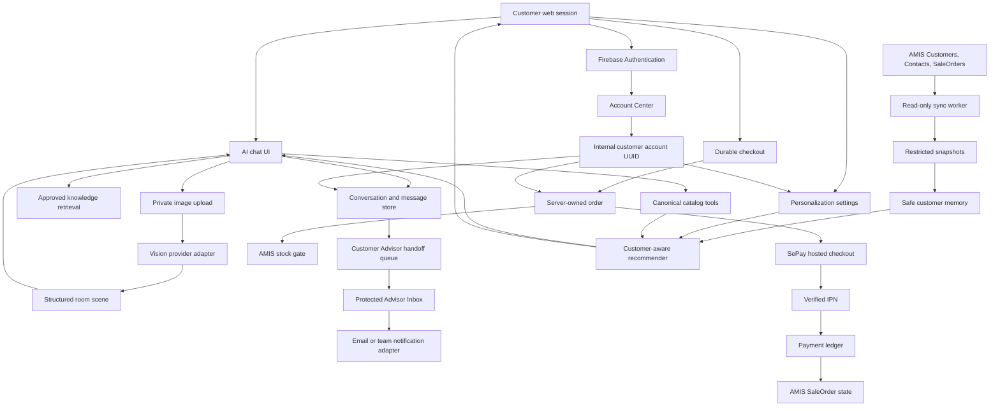

# nanoHome AI Commerce v3 — Execution Plan

Status: proposed implementation plan
Baseline reviewed: `origin/codex/ai-commerce-staging@b4d28a37cd77d895f8fea3ad72edc6f5fededd44`
Date: 2026-07-25

## 1. Outcome

This program turns the current local AI-commerce staging branch into five connected, usable customer journeys:

1. A grounded AI product advisor with a polite, lightly humorous voice.
2. Customer photo upload and real room/image understanding.
3. A durable Customer Advisor handoff with transcript, customer context, ownership, and follow-up status.
4. A real checkout using SePay, plus AMIS-backed personalization and recommendations.
5. A responsive Account Center backed by Firebase Authentication and a provider-neutral customer identity.

This plan supersedes the following v2 product decisions:

- ZaloPay is replaced by SePay.
- Product and image results in chat use horizontal carousels, never two-column grids.
- The global consent banner is removed as a product gate.
- AMIS approved orders represent purchases; other active orders represent quote/interest signals.
- Customer-specific recommendations use a safe AMIS projection rather than exposing raw CRM records.

The v2 migration history remains immutable. Every database change in this plan is a new additive forward migration.

## 2. Current truth

| Capability | Current staging truth |
| --- | --- |
| Text chat | Implemented behind `CHAT_ENABLED` and DeepSeek configuration |
| Product search | Implemented through the approved catalog RPC |
| Product cards | Implemented, but chat uses a separate card and a two-column grid |
| Knowledge | Small in-memory corpus built from localized website copy; no managed knowledge ingestion |
| Tone | Safe and factual, but no explicit polite-humorous tone contract |
| Customer image upload | Not implemented |
| Vision | Contracts and synthetic fixtures only; all runtime flags are off |
| Chat persistence | Tables exist, but the runtime does not write or restore conversations |
| Customer Advisor handoff | UI note only; the live handoff adapter throws `Staff handoff is not configured` |
| ZaloPay | Scaffold and tests only; no live transport, callback, credentials, or enabled UI |
| SePay | Not implemented |
| AMIS customer sync | Not implemented; current AMIS runtime is mainly inventory and SaleOrder scaffolding |
| Personalization | Fixture-backed, consent-gated, and mostly default-off |
| Recommendations | PDP-only, deterministic same-price-band logic |
| Account Center | Not implemented; the current post-registration `/vi/account` target has no route |
| Authentication | Supabase email/password only in staging; no passwordless, Google, Kakao, or phone-only flow |
| Cart/wishlist account state | Visible contexts are localStorage-based; no durable wishlist and the old commerce-cart API is retired |

Answer to the immediate vision question: **the current chat cannot read a customer-uploaded image**. DeepSeek V4 is used as a text model, the chat composer has no attachment control, requests to upload/analyze a room are rejected as unsupported, and the existing vision provider is synthetic.

## 3. Product decisions

### 3.1 Chat and vision

- DeepSeek remains the text reasoning/orchestration model.
- A separate real vision provider analyzes customer images into a strict, structured `RoomSceneRecord`.
- The text model receives only the structured, bounded vision result, not an unrestricted raw provider response.
- Product facts, price, stock, URL, and images are always rehydrated from the canonical server catalog.
- Product and media results render as horizontal, scroll-snapping carousels.
- The assistant may be lightly humorous, but never jokes about money, complaints, delivery incidents, product damage, privacy, or a customer's appearance/home.

### 3.2 Customer Advisor handoff

- Supabase is the durable queue and transcript store.
- A protected Advisor Inbox is the source of truth for assignment and status.
- Notifications contain a secure inbox link and a redacted summary, not the full transcript.
- AMIS customer ID is linked when verified. The plan does not invent an AMIS Tasks/Notes API.
- The first delivery channel is an internal inbox plus an email adapter. Slack/Teams/Zalo notification adapters may be added without changing the handoff contract.

### 3.3 Checkout and SePay

- SePay workstream Phase 1 enables `BANK_TRANSFER` only.
- Use the SePay hosted Payment Gateway flow and official Node.js SDK where its behavior passes contract tests.
- Redirect pages are presentation only. Payment becomes `paid` only after a verified IPN or server-to-server reconciliation.
- Guest checkout remains supported, but it must create a durable server-owned order before starting payment.
- Contact-price and mixed carts remain quote requests and do not start SePay.
- Zalo OA customer chat remains untouched; only ZaloPay payment code is replaced.

### 3.4 AMIS personalization

- AMIS is the source of truth for Customers, Contacts, and SaleOrders.
- Only an authenticated user with an exact, verified AMIS link gets CRM-backed personalization.
- `approved` means purchased according to nanoHome's business rule, after validating the exact tenant field/value.
- Other active, non-deleted SaleOrders mean `quoted_or_interested`.
- Guests receive only current-session personalization and never CRM history.
- Raw AMIS records, notes, phone, address, debt, and internal comments do not enter the browser or model prompt.

### 3.5 Removing consent

“Remove consent” means:

- remove the global consent modal/banner;
- stop blocking chat and account personalization on that banner;
- replace purpose-consent DTOs with normal product settings and server policy.

It does **not** mean:

- automatically enable marketing trackers;
- make CRM data public;
- remove retention, deletion, access control, audit, or account isolation;
- send customer records to DeepSeek;
- store customer images forever.

Account settings will provide “Cá nhân hóa”, “Dùng lịch sử AMIS”, “Dùng lịch sử duyệt”, “Xóa dữ liệu gợi ý”, and “Ngắt liên kết AMIS”. These are ordinary settings and opt-out controls, not a blocking pop-up.

### 3.6 Account and authentication

- Match the reviewed `new.nanohome.vn/account` visual language across desktop and mobile.
- Add profile, orders/detail, wishlist, cart, offers, personalization, and security pages.
- Replace Supabase Auth with Firebase Authentication upgraded with Identity Platform.
- Support email magic link, email/password, Google, Kakao Login, and phone-only SMS OTP.
- Keep Supabase Postgres/Storage, but decouple business ownership from `auth.users`.
- Use an internal `customer_accounts.id` UUID and map Firebase UID strings into it.
- Do not block orders, security, or privacy controls when optional profile fields are incomplete.

## 4. Target architecture

## 5. Delivery order

### Phase 0 — contract and tenant proof

Deliverables:

- redacted AMIS Customer, Contact, and SaleOrder payload samples;
- exact approved value and customer relation key;
- confirmation that AMIS list pagination starts at page `0`;
- SePay Sandbox merchant ID, secret, IPN configuration, and bank-transfer method;
- chosen private image storage and vision-provider benchmark;
- chosen Advisor notification destination and staff authentication model;
- Firebase/Identity Platform environment and domain strategy;
- Kakao OIDC proof, bcrypt user-import proof, and non-UUID Firebase UID/RLS proof.

Stop if any source identifier, status, payment callback, image lifecycle, or identity-migration proof is still ambiguous.

### Phase 1 — account identity and Firebase foundation

Deliverables:

- provider-neutral `customer_accounts` and identity mapping;
- legacy Supabase ownership backfill;
- Firebase session-cookie authorization;
- Supabase Firebase third-party JWT/RLS compatibility;
- Firebase/Kakao provider configuration behind feature flags.

No production customer is cut over until password, provider, ownership, and rollback proofs pass.

### Phase 2 — common data foundations

Deliverables:

- canonical guest/auth order identity;
- provider-neutral payment contracts and ledger;
- conversation persistence writer;
- customer-advisor queue schema;
- AMIS snapshot/projection schema;
- personalization settings schema;
- customer-offer eligibility/reservation and order-adjustment schema;
- private upload intent and attachment schema.

This phase does not enable external payment, AMIS writes, or customer image processing.

### Phase 3 — Account Center and authentication canary

Deliverables:

- responsive Account Center;
- all five login methods;
- profile/order/wishlist/cart/offer/security functions plus persisted preference controls;
- migration rehearsal and authenticated E2E;
- staff canary, then bounded customer cohorts.

The preferences page and setting persistence ship here, but AMIS-history controls/effects remain feature-flagged until Phase 8.

### Phase 4 — AMIS and knowledge shadow pipelines

Deliverables:

- page-0-safe Customers/Contacts/SaleOrders sync;
- managed approved knowledge ingestion;
- shadow customer-memory projections;
- shadow recommendation results;
- reconciliation and dead-letter reports.

Customer-visible behavior remains unchanged while shadow output is reviewed.

### Phase 5 — chat UX, persistence, and Advisor handoff

Deliverables:

- shared horizontal product/media carousels;
- tone contract and regression suite;
- persistent conversations;
- working “Chuyển cho tư vấn viên” flow;
- protected Advisor Inbox with assignment and closure.

### Phase 6 — vision

Deliverables:

- signed private upload;
- image validation and EXIF stripping;
- real vision provider;
- structured scene confirmation;
- visual/product retrieval;
- deletion and expiry jobs.

### Phase 7 — SePay Sandbox

Deliverables:

- durable guest/auth checkout;
- hosted SePay bank-transfer checkout;
- verified, idempotent IPN;
- payment status page and reconciliation job;
- manual refund operation with evidence;
- complete Sandbox scenario receipt.

### Phase 8 — AMIS personalization and canary

Deliverables:

- activation of AMIS-backed personalization settings without the consent banner;
- customer-aware home, PDP, chat, and cart recommendations;
- AMIS safe concierge context;
- canary at 5%, then 25%, then 100% of eligible authenticated users.

## 6. Workstreams

- [Master execution plan](./MASTER-EXECUTION.md)
- [Environment matrix](./ENVIRONMENT-MATRIX.md)
- [OMO/WSL implementation runbook](./OMO-RUNBOOK.md)
- [01 — AI Chat, Vision, and Customer Advisor](./01-ai-chat-vision-customer-advisor.md)
- [02 — SePay Checkout](./02-sepay-checkout.md)
- [03 — AMIS Personalization and Recommendations](./03-amis-personalization-recommendations.md)
- [04 — Account Center and Firebase Authentication Migration](./04-account-center-firebase-auth.md)

## 7. Program-level acceptance

The program is complete only when all of the following are proven:

- current staging mainline is merged without losing the six newer product-dimension fixes;
- no product/media chat result uses a grid;
- no model-authored price, stock, URL, or customer fact reaches the UI;
- uploaded images are private, bounded, expiring, deletable, and analyzed by a real provider;
- a Customer Advisor can receive, assign, open, and close a handoff;
- a reload restores the active conversation;
- SePay duplicate, delayed, forged, wrong-amount, wrong-reference, cancel, and reconciliation cases pass;
- a browser redirect cannot mark an order paid;
- AMIS page 0 is included and customer/order identity is exact;
- an unapproved SaleOrder never becomes a purchase signal;
- customer A cannot receive customer B's context or recommendations;
- logout/account switch cannot reuse a private cache;
- disabling personalization or disconnecting AMIS takes effect immediately;
- passwordless email, email/password, Google, Kakao, and phone-only authentication pass desktop/mobile E2E;
- legacy profiles, carts, orders, customer identity ledger, chats, images/Storage, AMIS links/memory, and personalization survive the auth migration;
- durable wishlist and canonical cart survive reload, account switch, and one-time guest merge;
- a non-UUID Firebase UID can access only its mapped internal account;
- a phone-only account can use the Account Center without adding an email;
- the approved phone-only checkout path does not require transactional email;
- profile incompleteness never blocks orders, security, or privacy controls;
- revoked Firebase sessions cannot access protected account routes;
- account deletion and Kakao unlink complete through an idempotent audited workflow;
- AMIS, SePay, vision, and notification outages each degrade to a safe, understandable state;
- build, lint, typecheck, unit/integration tests, SQL/RLS tests, authenticated Playwright E2E, Percy visual, accessibility, and locale checks pass.

## 8. External references

- [SePay Payment Gateway overview](https://developer.sepay.vn/vi/cong-thanh-toan/gioi-thieu)
- [SePay Node.js SDK](https://developer.sepay.vn/vi/cong-thanh-toan/sdk/nodejs)
- [SePay payment form and signature](https://developer.sepay.vn/vi/cong-thanh-toan/API/don-hang/form-thanh-toan)
- [SePay IPN](https://developer.sepay.vn/vi/cong-thanh-toan/IPN)
- [SePay Sandbox](https://developer.sepay.vn/vi/cong-thanh-toan/sandbox)
- [MISA CRM Connect v2](https://crmconnect.misa.vn/docs-v2/index.html)
- [DeepSeek API](https://api-docs.deepseek.com/)
- [Firebase Authentication](https://firebase.google.com/docs/auth)
- [Firebase OpenID Connect](https://firebase.google.com/docs/auth/web/openid-connect)
- [Firebase session cookies](https://firebase.google.com/docs/auth/admin/manage-cookies)
- [Supabase Firebase third-party Auth](https://supabase.com/docs/guides/auth/third-party/firebase-auth)
- [Kakao Login OIDC](https://developers.kakao.com/docs/en/kakaologin/rest-api)
